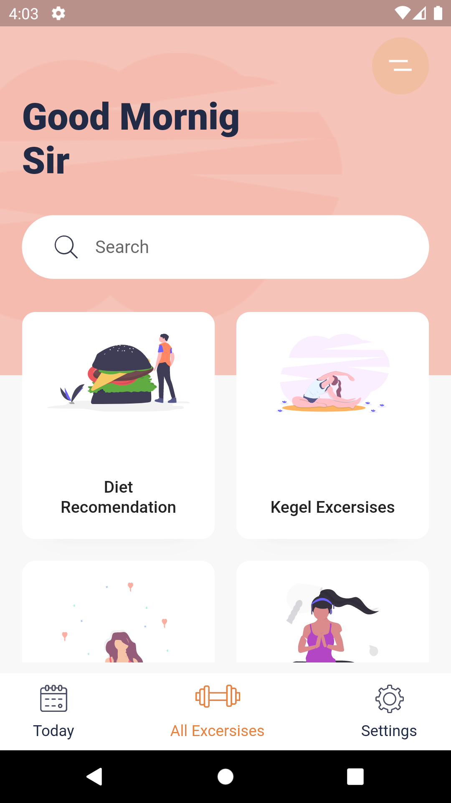
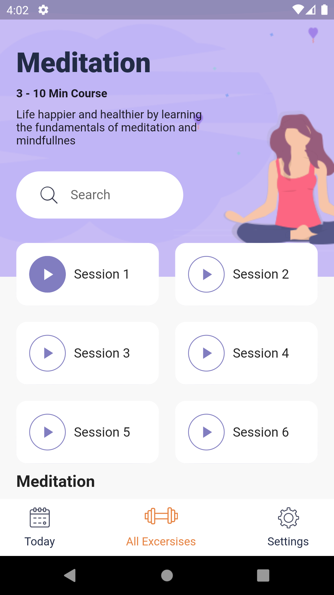

<!-- ABOUT THE PROJECT -->
## About The Project
<div align="center">
            
</div>
<br>
Flutter excersises app design with 2 design pages only
<br>
Design by : https://www.uplabs.com/posts/daily-exercises-app-freebie

<!-- GETTING STARTED -->
## Getting Started

This is an example of how you may give instructions on setting up your project locally.
To get a local copy up and running follow these simple example steps.

### Installation

_Below is an example of how you can instruct your audience on installing and setting up your app. This template doesn't rely on any external dependencies or services._

1. Using flutter 2.8 for this project
2. Clone the repo
   ```sh
   git clone https://github.com/Rinal-29/excersises-app.git
   ```
3. Flutter clean project
   ```sh
   flutter clean
   ```
4. Flutter get
   ```js
   flutter pub get
   ```
5. `flutter run` to run this project
   ```js
   flutter run or F5
   ```
   
<p align="right">(<a href="#top">back to top</a>)</p>
